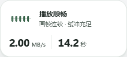

# BiliSmooth

**简体中文** | [English](./README.en.md)

[](https://github.com/Planetes1mal/BiliSmooth/releases/latest)


[](./LICENSE)

**看见 B 站视频的下载速度、可播余量和实际线路，在卡顿时尝试更合适的 CDN。**

BiliSmooth 是适用于 Chrome、Edge 的本地播放辅助扩展。它把实时指标和选线操作放在视频页浮窗中，并提供独立仪表盘，保持播放器中选择的画质。



*浮窗界面示意，使用演示数据。*

[下载最新版本](https://github.com/Planetes1mal/BiliSmooth/releases/latest) · [报告问题](https://github.com/Planetes1mal/BiliSmooth/issues) · [更新记录](./CHANGELOG.md)

## 为什么做这个项目

我在海外读书时，经常遇到 B 站视频反复缓冲。除了尝试更合适的线路，我也希望在观看时直接看到：下载有没有继续、当前倍速还能播放多久，以及实际由哪条线路供片。

BiliSmooth 参考并改造了 [realzza/bilibili-accelerator](https://github.com/realzza/bilibili-accelerator) 的线路处理与配置策略，在此基础上围绕自己的观看习惯设计浮窗、可播余量和线路仪表盘。感谢 realzza 以 MIT 许可公开这些工作。

## 可以做什么

| 功能 | 观看时的用途 |
| --- | --- |
| **视频页浮窗** | 查看真实下载速度、播放状态、可播余量和线路；可拖动、贴边、展开操作面板。 |
| **按倍速计算余量** | 显示还能持续观看的时间。例如缓冲了 20 秒视频，在 2× 下可播放约 10 秒。 |
| **自动或固定选线** | 根据当前网络探测和播放反馈选择 CDN，也可以手动固定节点。 |
| **卡顿恢复** | 在自动选线启用时，按播放状态尝试备用线路，并区分恢复尝试与已观察到的恢复。 |
| **独立仪表盘** | 集中查看下载曲线、实际供片、线路表现和运行记录，调整主题、语言与浮窗内容。 |

4K 等清晰度取决于 B 站提供的片源及账号权限；扩展保留你在播放器中选择的画质。

## 安装

需要 **Chrome 或 Edge 120 及以上版本**。目前通过 GitHub Release 安装，尚未上架扩展商店。

1. 在 [Releases](https://github.com/Planetes1mal/BiliSmooth/releases/latest) 下载 **`BiliSmooth-2.8.2.zip`** 并解压。选择这个安装包，无需下载 GitHub 自动生成的 Source code 压缩包。
2. 在浏览器地址栏打开 `chrome://extensions`，或在 Edge 中打开 `edge://extensions`。
3. 开启 **开发者模式**，点击 **加载已解压的扩展程序**。
4. 选择解压后包含 **`manifest.json`** 的文件夹。
5. 刷新已打开的 B 站视频页。看到 BiliSmooth 浮窗即表示页面端已加载；工具栏图标可以打开仪表盘。

请保留解压后的文件夹，浏览器会继续从这里加载扩展。

**升级：** 将新版解压到原安装目录，进入扩展管理页点击 BiliSmooth 的重新加载按钮，再刷新视频页。已有偏好会保留。

## 开始使用

1. **正常播放视频。** 默认自动选线；先观察浮窗中的速度与可播余量。
2. **需要调整时展开浮窗。** 可启停优化、选择线路、尝试备用线路或重新评估网络。
3. **打开仪表盘看详情。** 点击扩展工具栏图标，或使用浏览器中已配置的 `Alt+Shift+B` 快捷键。

手动固定线路后，自动换线会暂停。修改需要刷新才能完整生效的设置时，界面会给出提示。关闭优化并按提示刷新视频页，可使用原站线路。

## 隐私与权限

扩展使用本地存储权限及 B 站页面访问权限，用于保存偏好、连接视频页和处理播放请求。无需创建额外账户，也没有云同步。视频标题和封面用于当前界面；诊断导出会排除视频元数据与完整媒体地址。

详见 [隐私说明](./PRIVACY.md) 和 [第三方组件及来源](./NOTICE.md)。

## 开发与贡献

需要 **Node.js 24+**。从仓库根目录执行：

```sh
npm ci --ignore-scripts
npm run build
```

然后按安装步骤加载 **`dist/extension`**。运行 `npm test` 可检查播放核心。

- [贡献指南](./CONTRIBUTING.md)：提交问题、改动范围与本地验证。
- [架构说明](./docs/architecture.md)：模块职责和播放请求流程。
- [2.8.2 版本说明](./docs/releases/2.8.2.md)：功能介绍与安装方法。

遇到问题时，请在 [Issues](https://github.com/Planetes1mal/BiliSmooth/issues) 中提供浏览器与扩展版本、视频页面、画质、倍速，以及预期和实际表现。

## 许可与致谢

BiliSmooth 使用 [MIT 许可](./LICENSE)。线路与配置相关工作基于 [realzza/bilibili-accelerator](https://github.com/realzza/bilibili-accelerator) 的 MIT 开源代码进行改造；界面使用 Motion 和 Tabler Icons。相关归属和许可见 [NOTICE.md](./NOTICE.md)。
